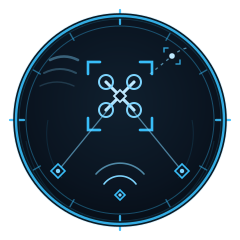

<p align="center">
  
</p>

# Manwe

> The training & sensor-fusion research ground for real-time airspace awareness — vision, audio, multi-camera and multi-target tracking on **Apple Metal** and **NVIDIA CUDA**.

Manwe is where the perception models and pipelines that power
[**crebain**](https://github.com/sepahead/crebain) (an adaptive airspace-awareness
system) are developed, trained, fine-tuned, evaluated, and exported. It pairs a
**Python training ground** — config-driven detector fine-tuning, acoustic
direction-of-arrival, multi-camera triangulation, and a multi-target sensor-fusion
tracker — with a **Rust/Candle + CoreML** inference and benchmarking stack for
deployment on Apple Silicon.

Every default in this repo traces back to a cited, adversarially fact-checked
survey of the 2026 state of the art: **[docs/research/SOTA-2026.md](docs/research/SOTA-2026.md)**.

Applications are civilian and dual-use: disaster-relief coordination, urban
delivery-drone deconfliction, infrastructure inspection, wildlife monitoring, and
airspace situational awareness.

---

## Why it's built this way

- **Pure-numpy core, lazy heavy deps.** The fusion, geometry, DOA, metrics, and
  contract layers depend only on numpy — they run and test anywhere. Heavy pillars
  (torch, ultralytics, coremltools, mlx, tensorrt) lazy-import and tell you exactly
  which extra to install.
- **One codebase, two accelerators.** Nothing hard-codes `cuda`. `resolve_device`
  selects CUDA → MPS → CPU with the right autocast dtype, so the same pipeline
  trains on Metal and NVIDIA.
- **The downstream contract is code.** The crebain class taxonomy and model-contract
  record live in `manwe.common.contracts`; exports carry a validated contract and
  pass an export-fidelity gate before hand-off.
- **Everything is measured.** Detection mAP / AP-small, tracking OSPA / GOSPA, and
  an MLPerf-style latency harness.

## The four capability pillars

| Pillar | What it does | Runnable today |
|--------|--------------|----------------|
| **vision** | Fine-tune aerial-object detectors (drone/bird/aircraft/helicopter), SAHI sliced small-object inference, export to 4 backends | training + export (needs `[vision]`); postprocess/mapping in pure numpy |
| **audio** | Microphone-array direction-of-arrival (GCC-PHAT / SRP-PHAT), log-mel/SPL features, acoustic→fusion bridge | ✅ pure numpy |
| **multicam** | Pinhole calibration, N-view DLT / midpoint triangulation, cross-camera correlation | ✅ pure numpy |
| **fusion** | KF / EKF / UKF / PF / IMM, Mahalanobis gating, M-of-N track lifecycle, OSPA/GOSPA, synthetic scenarios | ✅ pure numpy |

## Quick start

### Python training ground

```bash
cd python

# Core (numpy only) — the fusion/geometry/audio/eval core + CLI run immediately:
uv pip install -e .           # or: pip install -e .

# Heavy pillars (use Python 3.11–3.12; torch wheels lag new releases):
uv pip install -e '.[vision,export]'      # detector training + model export
uv pip install -e '.[all]'                # everything (minus platform-locked mlx/tensorrt)
```

The `manwe` CLI:

```bash
manwe doctor                    # hardware + which extras are installed
manwe models --track accuracy   # the detector zoo, with licenses
manwe data                      # dataset registry (Anti-UAV410, Drone-vs-Bird, VisDrone, MMAUD, …)
manwe synth /tmp/smoke          # generate an offline synthetic dataset (no downloads)
manwe fusion-sim                # compare KF/EKF/UKF/PF/IMM on a synthetic multi-sensor scenario
manwe vision-train configs/vision/aerial.yaml     # fine-tune (needs [vision])
manwe export best.pt -f onnx coreml               # export to crebain backends (needs [export])
```

`manwe fusion-sim` on the default 3-target, 3-sensor (visual + radar + acoustic)
scenario — mean OSPA (lower is better) over 41 frames:

```
filter           OSPA  localization  cardinality
kalman           3.67          1.80         2.16
ekf              3.67          1.80         2.16
ukf              3.67          1.80         2.16
particle         8.33          2.51         7.16   # PF needs more particles for multi-target
imm              2.90          1.92         1.11   # maneuver-adaptive bank wins here
```

### Rust inference CLI (deployment)

```bash
cargo build --release
./target/release/manwe --which s path/to/image.jpg          # detection
./target/release/manwe --which s --task pose path/to/image.jpg
```

## Using the pillars

```python
# Fusion — the Python twin of crebain's sensor_fusion.rs
from manwe.fusion import MultiSensorTracker, TrackerConfig, Measurement
tr = MultiSensorTracker(TrackerConfig(filter="ekf"))
tracks = tr.step([Measurement("radar", [120.0, 0.3, 0.1], [9.0, 4e-4, 4e-4], timestamp=0.0)], 0.0)

# Multi-camera — calibrate, correlate, triangulate
from manwe.multicam import Camera, Detection2D, correlate_and_triangulate
cams = [Camera.from_lookat([0,0,100],[0,0,0]), Camera.from_lookat([100,0,20],[0,0,0])]
dets3d = correlate_and_triangulate(cams, [...])

# Audio — array DOA → acoustic detection → fusion measurement
from manwe.audio import detect_from_array
det = detect_from_array(signals, mic_positions, fs=16000)
measurement = det.to_measurement(sensor_origin=array_xyz)

# Export — trained detector → crebain backend + contract + fidelity gate
from manwe.export import export_model, build_export_contract, fidelity_report
```

## Integration with crebain

manwe artifacts drop into crebain without adaptation. The full contract —
class taxonomy, model-contract record, acoustic + sensor-fusion measurement frames,
multi-camera geometry — is in **[docs/INTEGRATION_CREBAIN.md](docs/INTEGRATION_CREBAIN.md)**
and encoded in `manwe.common.contracts`.

## Benchmarks

`metal-yolo-tests/` compares YOLOv8s inference across three Apple Silicon backends.
Per the SOTA survey, the suite is being rebuilt on an MLPerf-style protocol (warm-up
discards, 100+ timed iterations, device sync, P50/P95/P99); `manwe.eval.benchmark`
provides that harness for the Python side.

| Backend (M4 Max, 500 imgs) | FPS | Latency (ms) | Hardware |
|---|---|---|---|
| **CoreML** | **80.33** | **12.45** | ANE / GPU / CPU |
| Rust (Candle) | 29.94 | 33.40 | Metal GPU |
| PyTorch MPS | 27.99 | 35.73 | Metal GPU |

## Documentation

- **[docs/ARCHITECTURE.md](docs/ARCHITECTURE.md)** — repo design & data flow
- **[docs/INTEGRATION_CREBAIN.md](docs/INTEGRATION_CREBAIN.md)** — the manwe → crebain contract
- **[docs/MODEL_CONTRACTS.md](docs/MODEL_CONTRACTS.md)** — what ships with every exported model
- **[docs/research/SOTA-2026.md](docs/research/SOTA-2026.md)** — the cited, verified SOTA survey

## Technology stack

| Component | Technology |
|-----------|-----------|
| Training | PyTorch (MPS + CUDA), Ultralytics, RF-DETR |
| Small-object | SAHI sliced inference/training, P2 head |
| Acoustic | numpy DSP (GCC-PHAT / SRP-PHAT), SELD (deep) |
| Fusion | numpy KF/EKF/UKF/PF/IMM, OSPA/GOSPA |
| Export | ONNX, CoreML (coremltools), MLX, TensorRT |
| Deployment (Rust) | [Candle](https://github.com/huggingface/candle) + Metal |

## Use cases

Disaster-relief aerial coordination · urban delivery-drone deconfliction ·
infrastructure inspection · wildlife monitoring · traffic & airspace situational
awareness.

## Contributing

See [CONTRIBUTING.md](CONTRIBUTING.md). The numpy-only core is fully testable with
zero heavy dependencies — `python -m pytest python/tests` (or the bundled runner).

## License

MIT — see [LICENSE](LICENSE). Note that some optional model backends carry their own
licenses (Ultralytics AGPL-3.0; RF-DETR XL/2XL PML-1.0) — see
[docs/MODEL_CONTRACTS.md](docs/MODEL_CONTRACTS.md) before redistributing weights.
