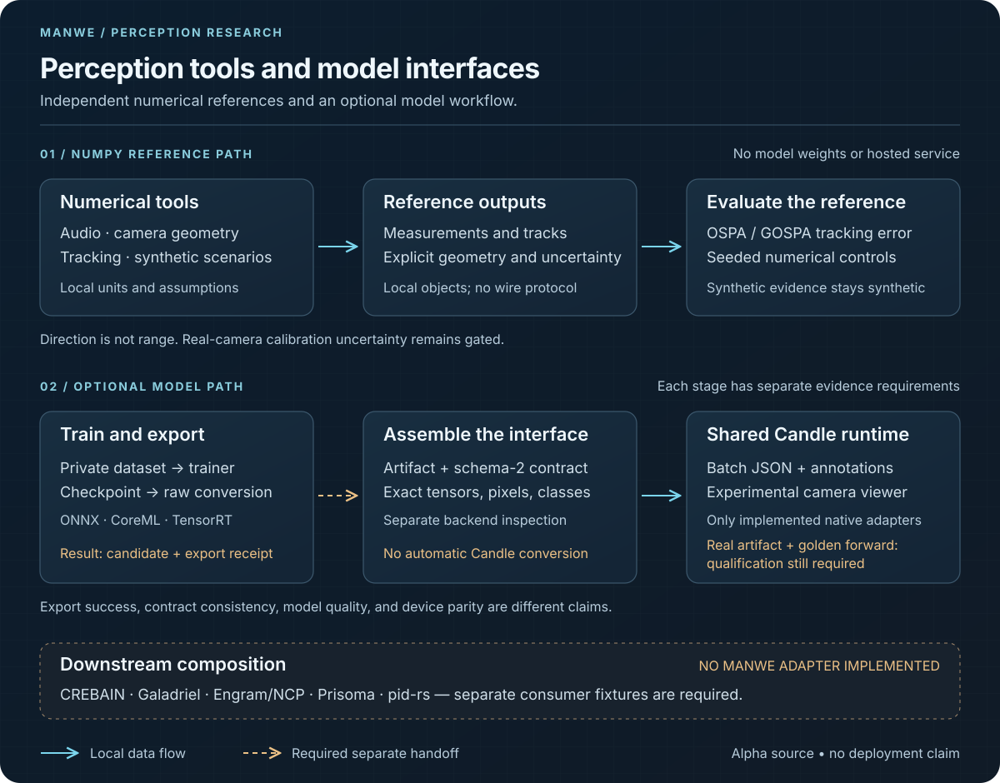

<p align="center">
  <picture>
    <source media="(prefers-color-scheme: dark)" srcset="assets/logo-dark.svg">
    
  </picture>
</p>

<p align="center"><a href="assets/archive/logos/README.md">Logo design archive</a></p>

# Manwe

**Perception research, from numerical references to checked model interfaces.**

Manwe provides tools for vision, microphone arrays, camera geometry, and multi-target tracking.
Its NumPy reference core runs independently of model runtimes.
Optional Python training and export tools produce candidates for evaluation.
Rust/Candle tools implement a separate contract-bound inference path.

**Alpha candidate: `0.2.0-alpha.1`.** APIs and numerical defaults can change.
The source targets Linux and Apple Silicon macOS; registry publication remains disabled.
CUDA execution, Windows workflows, real native model forwards, and downstream adapters remain unqualified release targets.

## Start with the reference simulation

Use Python 3.12 and the CI-pinned `uv` version, `0.11.28`.
Run these commands from a source checkout:

```bash
cd python
uv sync --locked
uv run --locked --no-sync -- .venv/bin/manwe fusion-sim
```

This seeded example compares five filters on a synthetic scenario with three targets and three sensors.
It reports tracking error over 41 frames.
The numerical core uses NumPy and needs no model weights, camera, GPU, or hosted service.

Lower OSPA means lower error under the chosen metric parameters.
Its localization and cardinality terms account for position error and mismatched target counts.
This example is a regression control; its scores do not establish real-world accuracy or superiority over another tracker.

For environment inspection, run `uv run --locked --no-sync -- .venv/bin/manwe doctor` from the same directory.
The [workflow guide](docs/WORKFLOWS.md) contains optional setup, API examples, and exact execution boundaries.

## How the parts relate

<picture>
  <source media="(max-width: 600px)" srcset="assets/architecture-mobile.svg">
  
</picture>

[Open the wide SVG](https://raw.githubusercontent.com/sepahead/manwe/main/assets/architecture.svg)
· [Open the portrait SVG](https://raw.githubusercontent.com/sepahead/manwe/main/assets/architecture-mobile.svg)
· [Read the architecture](docs/ARCHITECTURE.md)

Open either SVG to zoom without losing detail.
The [local diagram page](docs/architecture.html) provides both layouts and a text description when opened in a browser.

The numerical reference path produces local measurements, tracks, and metrics.
It does not publish an ecosystem wire format.
The optional model path separates training, raw conversion, interface inspection, and native execution.
Successful conversion alone does not complete that path.

## What runs, and what each result means

| Surface | Current implementation | Evidence boundary |
| --- | --- | --- |
| Tracking | KF, EKF, UKF, particle filter, IMM; association, lifecycle, OSPA/GOSPA | Independent numerical reference; no downstream tracker parity claim |
| Audio | GCC-PHAT and SRP-PHAT direction estimates; acoustic features | One microphone array estimates direction, not range; fusion requires independent ranging |
| Camera geometry | Calibration helpers, triangulation, cross-camera correlation | Current covariance requires analytically exact calibration; estimated real rigs remain gated |
| Vision | Architecture training, checkpoint inference, bounded sliced inference | Optional runtimes; candidate weights and detections require task-specific evaluation |
| Export and contracts | Raw ONNX, CoreML, TensorRT conversion; schema-2 contracts and fidelity tools | An export receipt lacks the separate interface evidence needed for a model package |
| Rust/Candle | Shared detect/pose runtime for batch CLI and experimental viewer | No checked-in converter supplies the exact graph; a real artifact and golden forward remain required |

Core Python supports versions 3.10–3.14.
The optional ML workflow uses Python 3.11–3.12; each backend has additional constraints.
CI covers Linux CPU and macOS Metal/viewer code paths.
That coverage does not qualify a real model or prove numerical parity across devices.

The native contract binds artifact bytes, tensors, preprocessing, source classes, and postprocessing.
Its digest does not establish authorship, accuracy, or permission to redistribute weights.
See [model contracts](docs/MODEL_CONTRACTS.md) for the exact distinction between a raw receipt, interface evidence, and an executable package.

## Place in the ecosystem

Manwe supplies research tools and candidate artifacts for separately implemented consumers.
It does not own CREBAIN's environment or Prisoma's experiment protocol.
There is no implemented Manwe adapter for CREBAIN, Galadriel, Engram/NCP, Prisoma, or pid-rs.

Every future adapter must declare tensors, frames, units, clocks, identities, missingness, and the consumer's statistical assumptions.
Matching filenames, array widths, or coordinate-axis letters cannot establish compatibility.
Ragged detections and autocorrelated tracking frames need an explicit extraction and validity contract before PID analysis.

The [integration audit](docs/INTEGRATION_CREBAIN.md) retains dated source observations and required promotion gates.
Its historical consumer revisions do not describe later ecosystem releases.
Current Manwe source still supplies no downstream adapter.

## Work on Manwe

For the NumPy development suite, run these commands from the repository root:

```bash
make setup
make test
make lint
make typecheck
```

[CONTRIBUTING.md](CONTRIBUTING.md) defines platform checks and dependency policy.
[AGENTS.md](AGENTS.md) routes agent tasks to the same owning documents.
Rust work requires version 1.95 or newer; Metal and CUDA checks require the corresponding host toolchains.

| Read next | Purpose |
| --- | --- |
| [Workflows](docs/WORKFLOWS.md) | Optional training, export, native CLI, recovery, and numerical API examples |
| [Architecture](docs/ARCHITECTURE.md) | Ownership, data flow, dataset snapshots, runtime boundaries |
| [Model contracts](docs/MODEL_CONTRACTS.md) | Exact artifact interface, receipt semantics, fidelity, and publication |
| [Python package](python/README.md) | Lightweight core and optional runtime setup |
| [Consumer audit](docs/INTEGRATION_CREBAIN.md) | Historical compatibility findings and required adapter fixtures |
| [Benchmark guide](metal-yolo-tests/README.md) | Retained timing scopes and comparison requirements |
| [Research survey](docs/research/SOTA-2026.md) | Dated research context; no automatic model or default adoption |
| [Release guide](docs/RELEASING.md) | Alpha gates, source identity, and registry restrictions |
| [Security](SECURITY.md) · [Changelog](CHANGELOG.md) | Trust boundaries, reporting, and recorded changes |

## License

Manwe source uses the [MIT license](LICENSE).
Checkpoints, derived weights, datasets, exporters, and dependencies retain their own terms.
Review exact source and data rights before redistribution.
The font and adapted Candle examples retain their notices in [THIRD_PARTY_NOTICES.md](THIRD_PARTY_NOTICES.md).
