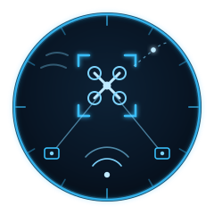
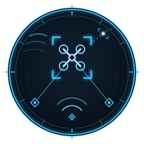

# manwe logo archive

This archive preserves earlier designs and captured design drafts.
The main repository README selects the active logo.
Archived artwork can contain superseded symbols or wording.
It does not establish current behavior, compatibility, authority, or release status.

[Manifest and exact source identities](manifest.json)

Each file retains its source bytes or an explicitly identified extraction from a historical portfolio SVG.
Extracted marks retain their source geometry, applicable styles, and referenced definitions.
No historical JavaScript was executed.
Dates identify the earliest captured source commit for those bytes, not necessarily the original design date.
Files use exact SHA-256 deduplication within this archive.

The archive excludes third-party marks, repeated platform icon sizes, and complete connection diagrams.
The manifest records any extraction gaps.

Select a preview to open the asset. Native SVG files retain scalable geometry.
Historical motion and accessibility behavior remain as originally stored.
The archive does not certify those older behaviors.

## MANWE

| Preview | Design | Source |
| --- | --- | --- |
|  | [2026-07-07-001-profile-dark-e58c9e0720](manwe/2026-07-07-001-profile-dark-e58c9e0720.svg) | [fe550c6c17](https://github.com/sepahead/sepahead/blob/fe550c6c17b09f383a3f668205d6f29edf158588/assets/work-graph-dark.svg) |
|  | [2026-07-07-002-profile-light-f06fa8907b](manwe/2026-07-07-002-profile-light-f06fa8907b.svg) | [fe550c6c17](https://github.com/sepahead/sepahead/blob/fe550c6c17b09f383a3f668205d6f29edf158588/assets/work-graph-light.svg) |
|  | [2026-07-10-003-manwe-logo-d31b0d5f38](manwe/2026-07-10-003-manwe-logo-d31b0d5f38.svg) | [3db6ee87ed](https://github.com/sepahead/manwe/blob/3db6ee87edaa9f72fbdf7912d23225746b5732d6/assets/manwe-logo.svg) |
|  | [2026-07-10-004-profile-dark-1c795c39a9](manwe/2026-07-10-004-profile-dark-1c795c39a9.svg) | [53625ad568](https://github.com/sepahead/sepahead/blob/53625ad5687d69a92ba09ec831ba269192191dba/assets/work-graph-dark.svg) |
|  | [2026-07-10-005-profile-light-7f24dee39d](manwe/2026-07-10-005-profile-light-7f24dee39d.svg) | [53625ad568](https://github.com/sepahead/sepahead/blob/53625ad5687d69a92ba09ec831ba269192191dba/assets/work-graph-light.svg) |
|  | [2026-07-10-006-manwe-logo-6731d11a5d](manwe/2026-07-10-006-manwe-logo-6731d11a5d.svg) | [c840607188](https://github.com/sepahead/manwe/blob/c840607188fe25b7274ae86ef10d125128abc7d5/assets/manwe-logo.svg) |
|  | [2026-07-10-007-profile-dark-ccf2bba85a](manwe/2026-07-10-007-profile-dark-ccf2bba85a.svg) | [52ad69ad9d](https://github.com/sepahead/sepahead/blob/52ad69ad9d4fb6c1995dbcc8a778232cbae015e5/assets/work-graph-dark.svg) |
|  | [2026-07-10-008-profile-light-f185abb006](manwe/2026-07-10-008-profile-light-f185abb006.svg) | [52ad69ad9d](https://github.com/sepahead/sepahead/blob/52ad69ad9d4fb6c1995dbcc8a778232cbae015e5/assets/work-graph-light.svg) |
|  | [2026-07-10-009-manwe-logo-38fbf44717](manwe/2026-07-10-009-manwe-logo-38fbf44717.svg) | [706ceba713](https://github.com/sepahead/manwe/blob/706ceba7137a0cef4410b729e7284cfc71cc2fc4/assets/manwe-logo.svg) |
|  | [2026-07-10-010-profile-dark-f49bab047f](manwe/2026-07-10-010-profile-dark-f49bab047f.svg) | [32a11d43bb](https://github.com/sepahead/sepahead/blob/32a11d43bb57f500d940ee3c8daf2bcfd63b4f5e/assets/work-graph-dark.svg) |
|  | [2026-07-10-011-profile-light-df0cc4a181](manwe/2026-07-10-011-profile-light-df0cc4a181.svg) | [32a11d43bb](https://github.com/sepahead/sepahead/blob/32a11d43bb57f500d940ee3c8daf2bcfd63b4f5e/assets/work-graph-light.svg) |
|  | [2026-07-12-012-profile-dark-21a60a38ed](manwe/2026-07-12-012-profile-dark-21a60a38ed.svg) | [6c173a05f1](https://github.com/sepahead/sepahead/blob/6c173a05f1655eac25d7b3bf7f551bb0cec2aeeb/assets/work-graph-dark.svg) |
|  | [2026-07-12-013-profile-light-f264b69b32](manwe/2026-07-12-013-profile-light-f264b69b32.svg) | [6c173a05f1](https://github.com/sepahead/sepahead/blob/6c173a05f1655eac25d7b3bf7f551bb0cec2aeeb/assets/work-graph-light.svg) |
|  | [2026-07-12-014-profile-dark-21cd83d818](manwe/2026-07-12-014-profile-dark-21cd83d818.svg) | [8efeeab875](https://github.com/sepahead/sepahead/blob/8efeeab875d59d692ce3f7388e160bb3dd2d0aac/assets/work-graph-dark.svg) |
|  | [2026-07-12-015-profile-light-d46aa1bb5b](manwe/2026-07-12-015-profile-light-d46aa1bb5b.svg) | [8efeeab875](https://github.com/sepahead/sepahead/blob/8efeeab875d59d692ce3f7388e160bb3dd2d0aac/assets/work-graph-light.svg) |
|  | [2026-07-12-016-profile-dark-1ed97cbcee](manwe/2026-07-12-016-profile-dark-1ed97cbcee.svg) | [9b122bb9e7](https://github.com/sepahead/sepahead/blob/9b122bb9e767613abbba34526f9af6e7f18dbdb5/assets/work-graph-dark.svg) |
|  | [2026-07-12-017-profile-light-34f78cd989](manwe/2026-07-12-017-profile-light-34f78cd989.svg) | [9b122bb9e7](https://github.com/sepahead/sepahead/blob/9b122bb9e767613abbba34526f9af6e7f18dbdb5/assets/work-graph-light.svg) |
|  | [2026-07-12-018-profile-dark-fcb6b8feae](manwe/2026-07-12-018-profile-dark-fcb6b8feae.svg) | [b2f012141a](https://github.com/sepahead/sepahead/blob/b2f012141aa6191bd281b4af5bd71b5776715b4b/assets/work-graph-dark.svg) |
|  | [2026-07-12-019-profile-light-ff6375632e](manwe/2026-07-12-019-profile-light-ff6375632e.svg) | [b2f012141a](https://github.com/sepahead/sepahead/blob/b2f012141aa6191bd281b4af5bd71b5776715b4b/assets/work-graph-light.svg) |
|  | [2026-07-12-020-profile-dark-e23724c6c4](manwe/2026-07-12-020-profile-dark-e23724c6c4.svg) | [7d15b710f6](https://github.com/sepahead/sepahead/blob/7d15b710f674da20d81121b9efba5b927d9684f2/assets/work-graph-dark.svg) |
|  | [2026-07-12-021-profile-light-61b7a5d6c9](manwe/2026-07-12-021-profile-light-61b7a5d6c9.svg) | [7d15b710f6](https://github.com/sepahead/sepahead/blob/7d15b710f674da20d81121b9efba5b927d9684f2/assets/work-graph-light.svg) |
|  | [2026-07-12-022-logo-dark-7e9272cabf](manwe/2026-07-12-022-logo-dark-7e9272cabf.svg) | [943acb32b5](https://github.com/sepahead/manwe/blob/943acb32b596e1f78cf334104cb1d8628a06dd20/assets/logo-dark.svg) |
|  | [2026-07-12-023-logo-light-024a08e52f](manwe/2026-07-12-023-logo-light-024a08e52f.svg) | [943acb32b5](https://github.com/sepahead/manwe/blob/943acb32b596e1f78cf334104cb1d8628a06dd20/assets/logo-light.svg) |
|  | [2026-07-12-024-profile-dark-bb9f5bd3a4](manwe/2026-07-12-024-profile-dark-bb9f5bd3a4.svg) | [994b1f0d04](https://github.com/sepahead/sepahead/blob/994b1f0d044e13c1699071168b3a4c8f0dcecfe8/assets/work-graph-dark.svg) |
|  | [2026-07-12-025-profile-light-d01eb243c1](manwe/2026-07-12-025-profile-light-d01eb243c1.svg) | [994b1f0d04](https://github.com/sepahead/sepahead/blob/994b1f0d044e13c1699071168b3a4c8f0dcecfe8/assets/work-graph-light.svg) |
|  | [2026-07-12-026-logo-dark-79e0993306](manwe/2026-07-12-026-logo-dark-79e0993306.svg) | [69b8c10b3e](https://github.com/sepahead/manwe/blob/69b8c10b3e55e699d9a0a72908d52a7e92bfd62e/assets/logo-dark.svg) |
|  | [2026-07-12-027-logo-light-1c6a8acba8](manwe/2026-07-12-027-logo-light-1c6a8acba8.svg) | [69b8c10b3e](https://github.com/sepahead/manwe/blob/69b8c10b3e55e699d9a0a72908d52a7e92bfd62e/assets/logo-light.svg) |
|  | [2026-07-12-028-profile-dark-102603e9c3](manwe/2026-07-12-028-profile-dark-102603e9c3.svg) | [ccd8062d1e](https://github.com/sepahead/sepahead/blob/ccd8062d1eacddbc4050d511ba24592d42e50501/assets/work-graph-dark.svg) |
|  | [2026-07-12-029-profile-light-27ace80a2f](manwe/2026-07-12-029-profile-light-27ace80a2f.svg) | [ccd8062d1e](https://github.com/sepahead/sepahead/blob/ccd8062d1eacddbc4050d511ba24592d42e50501/assets/work-graph-light.svg) |
|  | [2026-07-12-030-logo-dark-967a3659d6](manwe/2026-07-12-030-logo-dark-967a3659d6.svg) | [73da4e5c4e](https://github.com/sepahead/manwe/blob/73da4e5c4e82e69fe5ae0c078694ebf3e79bbe1f/assets/logo-dark.svg) |
|  | [2026-07-12-031-logo-light-5a5575d8bb](manwe/2026-07-12-031-logo-light-5a5575d8bb.svg) | [73da4e5c4e](https://github.com/sepahead/manwe/blob/73da4e5c4e82e69fe5ae0c078694ebf3e79bbe1f/assets/logo-light.svg) |
|  | [2026-07-12-032-profile-dark-ee667ae443](manwe/2026-07-12-032-profile-dark-ee667ae443.svg) | [2b3b320ab6](https://github.com/sepahead/sepahead/blob/2b3b320ab6be41bbee76d4a4812ba9f1ff9cb1c0/assets/work-graph-dark.svg) |
|  | [2026-07-12-033-profile-light-99594c822a](manwe/2026-07-12-033-profile-light-99594c822a.svg) | [2b3b320ab6](https://github.com/sepahead/sepahead/blob/2b3b320ab6be41bbee76d4a4812ba9f1ff9cb1c0/assets/work-graph-light.svg) |
|  | [2026-07-12-034-logo-dark-388c3226b8](manwe/2026-07-12-034-logo-dark-388c3226b8.svg) | [aaa1e6b908](https://github.com/sepahead/manwe/blob/aaa1e6b90860af953d190ff213d42e3cc63ced63/assets/logo-dark.svg) |
|  | [2026-07-12-035-logo-light-da29e63ba4](manwe/2026-07-12-035-logo-light-da29e63ba4.svg) | [aaa1e6b908](https://github.com/sepahead/manwe/blob/aaa1e6b90860af953d190ff213d42e3cc63ced63/assets/logo-light.svg) |
|  | [2026-07-13-036-profile-dark-a60b2fe6cd](manwe/2026-07-13-036-profile-dark-a60b2fe6cd.svg) | [f43e6cc8ce](https://github.com/sepahead/sepahead/blob/f43e6cc8cefdc5d136967b86cda983474b68f57f/assets/work-graph-dark.svg) |
|  | [2026-07-13-037-profile-light-694f247788](manwe/2026-07-13-037-profile-light-694f247788.svg) | [f43e6cc8ce](https://github.com/sepahead/sepahead/blob/f43e6cc8cefdc5d136967b86cda983474b68f57f/assets/work-graph-light.svg) |
|  | [2026-07-13-038-logo-dark-2e0a05b445](manwe/2026-07-13-038-logo-dark-2e0a05b445.svg) | [d4acef353e](https://github.com/sepahead/manwe/blob/d4acef353e78b444f5d46b5241065244d9cd6f0d/assets/logo-dark.svg) |
|  | [2026-07-13-039-logo-light-11f633f923](manwe/2026-07-13-039-logo-light-11f633f923.svg) | [d4acef353e](https://github.com/sepahead/manwe/blob/d4acef353e78b444f5d46b5241065244d9cd6f0d/assets/logo-light.svg) |
|  | [2026-07-13-040-profile-dark-538c00147c](manwe/2026-07-13-040-profile-dark-538c00147c.svg) | [d7bfa2cfe5](https://github.com/sepahead/sepahead/blob/d7bfa2cfe5ee10aa7ceec9c067744699d267e380/assets/work-graph-dark.svg) |
|  | [2026-07-13-041-profile-light-5e17572ef7](manwe/2026-07-13-041-profile-light-5e17572ef7.svg) | [d7bfa2cfe5](https://github.com/sepahead/sepahead/blob/d7bfa2cfe5ee10aa7ceec9c067744699d267e380/assets/work-graph-light.svg) |
|  | [2026-07-13-042-logo-dark-ac265fb9dc](manwe/2026-07-13-042-logo-dark-ac265fb9dc.svg) | [bdc4204fd4](https://github.com/sepahead/manwe/blob/bdc4204fd402b2cc6208045d382e4d4f7697e7ea/assets/logo-dark.svg) |
|  | [2026-07-13-043-logo-light-5511d07683](manwe/2026-07-13-043-logo-light-5511d07683.svg) | [bdc4204fd4](https://github.com/sepahead/manwe/blob/bdc4204fd402b2cc6208045d382e4d4f7697e7ea/assets/logo-light.svg) |
|  | [2026-07-13-044-profile-dark-9f6b9e3fa9](manwe/2026-07-13-044-profile-dark-9f6b9e3fa9.svg) | [219741fdc5](https://github.com/sepahead/sepahead/blob/219741fdc576ad5ba86a21016a323254d8973489/assets/work-graph-dark.svg) |
|  | [2026-07-13-045-profile-light-ad5ac5e0a1](manwe/2026-07-13-045-profile-light-ad5ac5e0a1.svg) | [219741fdc5](https://github.com/sepahead/sepahead/blob/219741fdc576ad5ba86a21016a323254d8973489/assets/work-graph-light.svg) |
|  | [2026-07-13-046-logo-dark-27af401156](manwe/2026-07-13-046-logo-dark-27af401156.svg) | [d16c454cef](https://github.com/sepahead/manwe/blob/d16c454cef914734ab720540a0d7787bc4d084a9/assets/logo-dark.svg) |
|  | [2026-07-13-047-logo-light-caf520bd77](manwe/2026-07-13-047-logo-light-caf520bd77.svg) | [d16c454cef](https://github.com/sepahead/manwe/blob/d16c454cef914734ab720540a0d7787bc4d084a9/assets/logo-light.svg) |
|  | [2026-07-26-048-profile-dark-58b7914020](manwe/2026-07-26-048-profile-dark-58b7914020.svg) | [a6833b5d27](https://github.com/sepahead/sepahead/blob/a6833b5d27b7444efb94072a73ed021912933ea0/assets/work-graph-dark.svg) |
|  | [2026-07-26-049-profile-light-820b368d55](manwe/2026-07-26-049-profile-light-820b368d55.svg) | [a6833b5d27](https://github.com/sepahead/sepahead/blob/a6833b5d27b7444efb94072a73ed021912933ea0/assets/work-graph-light.svg) |
|  | [2026-08-10-050-logo-dark-864467b688](manwe/2026-08-10-050-logo-dark-864467b688.svg) | [b20f00b985](https://github.com/sepahead/manwe/blob/b20f00b98585e26d10b786d769abd011a51bee9c/assets/logo-dark.svg) |
|  | [2026-08-10-051-logo-light-212764a532](manwe/2026-08-10-051-logo-light-212764a532.svg) | [b20f00b985](https://github.com/sepahead/manwe/blob/b20f00b98585e26d10b786d769abd011a51bee9c/assets/logo-light.svg) |
|  | [2026-08-20-052-profile-dark-79336c17b2](manwe/2026-08-20-052-profile-dark-79336c17b2.svg) | [6f89d6c19d](https://github.com/sepahead/sepahead/blob/6f89d6c19d8b87556f66c91e73486163400ec8d2/assets/work-graph-dark.svg) |
|  | [2026-09-05-053-profile-dark-b4f1887887](manwe/2026-09-05-053-profile-dark-b4f1887887.svg) | [ed898bd827](https://github.com/sepahead/sepahead/blob/ed898bd827fd393b1a6262b48517a92c3b12d4b4/assets/work-graph-dark.svg) |
|  | [2026-09-05-054-profile-dark-3405b80242](manwe/2026-09-05-054-profile-dark-3405b80242.svg) | [8740c531cb](https://github.com/sepahead/sepahead/blob/8740c531cbb5cc9b74a74fe8e4d4018940700483/assets/work-graph-dark.svg) |
